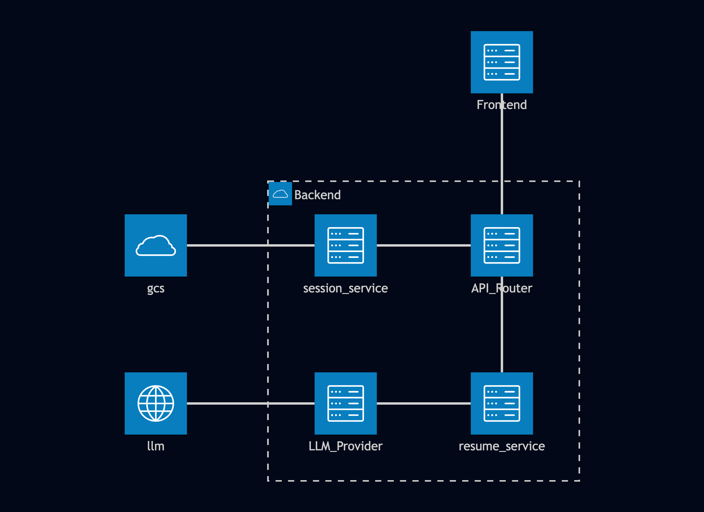
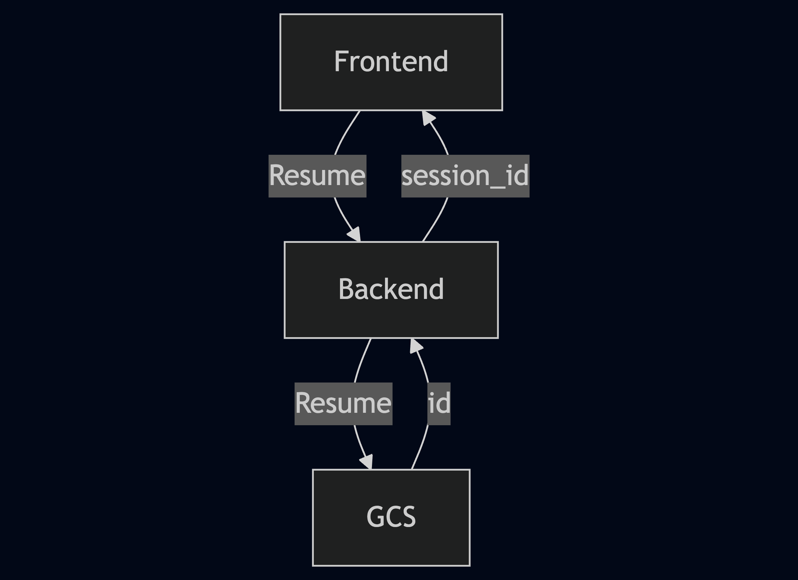
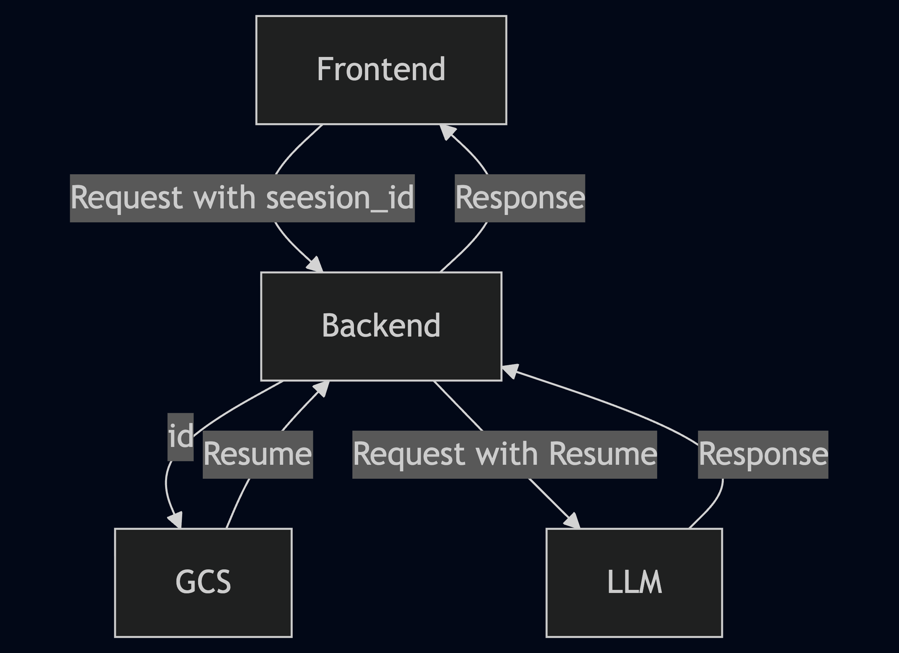

# ResumAI System Design Document

**Version: MVP Draft**  
**Author: Asheng, Bowen, Harrison, Hugo, Lin, Jason, Jayking, Jerome, Jimmy, John, Max, Ron**  
**Date: 2025.12**

**[1\. Introduction and overview	2](#introduction-and-overview)**

[**2\. System architecture	2**](#system-architecture)

[2.1 High level system architecture diagram	2](#high-level-system-architecture-diagram)

[2.2 Description on each component	4](#description-on-each-component)

[1\. Frontend (React)	4](#frontend-\(react\))

[2\. Backend (FastAPI Monolithic Service)	5](#backend-\(fastapi-monolithic-service\))

[3\. LLM Provider API	5](#llm-provider-api)

[4\. Google Cloud Storage (GCS) — Resume File Storage	5](#google-cloud-storage-\(gcs\)-—-resume-file-storage)

[5\. Google Cloud Run	5](#google-cloud-run)

[2.3 Explanation on design decisions and trade-offs	5](#explanation-on-design-decisions-and-trade-offs)

[1\. Monolithic vs. Microservices	5](#monolithic-vs.-microservices)

[2\. Use External LLM Instead of Custom NLP	5](#use-external-llm-instead-of-custom-nlp)

[3\. Cloud Run vs. Compute Engine	5](#cloud-run-vs.-compute-engine)

[4\. Session-Based Data Instead of User Accounts	6](#session-based-data-instead-of-user-accounts)

[**3\. Data design	6**](#data-design)

[3.1 Data flow diagram and description	6](#data-flow-diagram-and-description)

[Scenario A: Uploading a Resume	8](#scenario-a:-uploading-a-resume)

[Scenario B: Analyzing Resume	9](#scenario-b:-analyzing-resume)

[Scenario C: Analyzing Resume with JD (Matching Score)	9](#scenario-c:-analyzing-resume-with-jd-\(matching-score\))

[Scenario D: Optimizing and Downloading Resume	10](#scenario-d:-optimizing-and-downloading-resume)

[Option 1: General Optimization (No JD)	10](#option-1:-general-optimization-\(no-jd\))

[Option 2: JD-Specific Optimization (With JD)	10](#option-2:-jd-specific-optimization-\(with-jd\))

[3.2 How data is used for communication	11](#how-data-is-used-for-communication)

[**4\. Interface design	12**](#interface-design)

[4.1 API Summary Table	12](#4.1-api-summary-table)

[4.2 API Endpoints	13](#4.2-api-endpoints)

[4.2.1 Upload & Parse Resume	13](#4.2.1-upload-&-parse-resume)

[4.2.2 Analyze Resume	14](#4.2.2-analyze-resume)

[4.2.3 Match Resume with Job Description	15](#4.2.3-match-resume-with-job-description)

[4.2.4 Optimize Resume	17](#4.2.4-optimize-resume)

[4.3 Protocols and specifications	18](#heading=h.567awl40ayfa)

[4.3 HTTP Status Codes	19](#4.3-http-status-codes)

[**5\. UI design	19**](#ui-design)

[5.1 Simple wireframe for frontend components	19](#simple-wireframe-for-frontend-components)

[5.2 Description of workflow and interaction	20](#description-of-workflow-and-interaction)

[**6\. Infrastructure design	21**](#infrastructure-design)

[6.1 Flow diagram of system release & deployments	21](#flow-diagram-of-system-release-&-deployments)

[6.2 Infrastructure Component Selection: Cloud Run vs Compute Engine	22](#infrastructure-component-selection:-cloud-run-vs-compute-engine)

## 1. Introduction and overview {#introduction-and-overview}

ResumAI is a web-based AI resume optimization platform designed to help users transform their resumes into job-aligned, professional documents. By analyzing both the user's uploaded resume and a target job description (JD), the system generates an improved version of the resume along with match score and suggestions.

At the MVP stage, ResumAI supports the following user-facing functions:

* Uploading resumes in PDF, DOCX, TXT, or plain text format  
* Inputting JD text  
* AI-powered resume optimization using an external LLM provider  
* Calculating resume–JD match score  
* Exporting the optimized resume in Markdown format, facilitating easy version control and content editing.

The product workflow remains intentionally simple to support fast user interaction:

**1.Upload Resume → AI Analyzation → View General Score & Revision Suggestions**

**2.Upload Resume → Input JD → AI Analyzation → View Matching Score & Revision Suggestions**

**3.Upload Resume → Input JD (Optional) → AI Optimization → Download Improved Resume**

The technical stack include:

* Backend \-\> FastAPI  
* Frontend \-\> React  
* AI integration \-\> LLM Provider or other API, instead of building NLP models  
* Infra \-\> Deploy on Google Cloud  
* CI/CD \-\> Automated deployment using GitHub Actions  
* Architecture \-\> Monolithic backend  
* Data Model \-\> Stateless or session-based user data

## 2. System architecture {#system-architecture}

### 2.1 High level system architecture diagram {#high-level-system-architecture-diagram}

The system architecture follows a client–server model with a monolithic FastAPI backend, a React-based frontend, integration with an LLM provider for optimization, and Google Cloud components for hosting and temporary file storage. The architecture ensures stateless execution, simplified deployment, and scalability using Cloud Run.

### 2.2 Description on each component {#description-on-each-component}

#### 2.2.1 Frontend (React) {#frontend-(react)}

* Chat page  
* Add / Edit Job modals  
* Chat input and message rendering  
* Converts user actions into API call

#### 2.2.2 Backend (FastAPI Monolithic Service) {#backend-(fastapi-monolithic-service)}

* Handles all business logic, routing, and API responses  
* Manages temporary resume/JD data for each session  
* Construct prompts using job \+ resume \+ chat history and send them to the LLM, then return responses  
* Returns structured JSON data containing optimized content, allowing the frontend to handle rendering and file generation.  
* Store and retrieve resume files from Google Cloud Storage  
* Ensures file-level privacy for each session

#### 2.2.3 LLM Provider API {#llm-provider-api}

* Performs resume rewriting and optimization  
* Generates suggestions and improved text  
* Provides semantic comparison for match scoring  
* **External API** (e.g., OpenAI, Anthropic, Gemini)

#### 2.2.4 Google Cloud Storage (GCS) — Resume File Storage {#google-cloud-storage-(gcs)-—-resume-file-storage}

* Stores uploaded files temporarily

#### 2.2.5 Google Cloud Run {#google-cloud-run}

* Automatic scaling  
* No server maintenance  
* Pay-per-use efficiency  
* Ideal for stateless API workloads

### 2.3 Explanation on design decisions and trade-offs {#explanation-on-design-decisions-and-trade-offs}

#### 2.3.1 Monolithic vs. Microservices {#monolithic-vs.-microservices}

Choice: Monolithic FastAPI server  
Reason: The MVP includes only three major functional areas:

* Resume  
  * Job Cards  
  * Chat

  Splitting them into separate microservices would add unnecessary overhead and slow down development.

A monolithic backend keeps deployment simple and development fast.

#### 2.3.2 Use External LLM Instead of Custom NLP {#use-external-llm-instead-of-custom-nlp}

Choice: External LLM Provider API  
Reason: No need to train ML models; faster time-to-market  
Trade-off: Dependency on external provider, cost per request

#### 2.3.3 Cloud Run vs. Compute Engine {#cloud-run-vs.-compute-engine}

Choice: Google Cloud Run  
Reason: 

* Fully managed auto-scaling  
* No server/VM maintenance  
* Much lower cost for low-traffic MVP projects  
* Extremely fast deployment and rollback  
* Naturally fits a stateless FastAPI application  
  Compute Engine would be heavy, costly, and unnecessary—"Using a large  cast-iron wok just to fry two eggs."

Trade-off: Limited control over long-running processes (not required for MVP)

#### 2.3.4 Session-Based Data Instead of User Accounts {#session-based-data-instead-of-user-accounts}

Choice: Anonymous usage with session tokens  
Reason: MVP does not include login; privacy preserved through scoped sessions  
Trade-off: No long-term data persistence until Phase 2

## 3. Data design {#data-design}

### 3.1 Data flow diagram and description {#data-flow-diagram-and-description}

Data flow1: upload resume, save to GCS, create id, return session\_id

Data flow2: request from frontend, get resume from GCS at backend, request from backend, construct response from LLM, return response to frontend

Key Components:

* Request Router: Routes request to Mode A or Mode B based on JD presence  
* Resume Parser: Extracts resume content  
* JD Handler: Processes job description (Mode B only)  
* Match Scoring: Calculates resume-JD compatibility (Mode B only)  
* LLM Engine: Calls external LLM Provider for optimization  
* Export Service: Generates final document  
* Cloud Storage: Stores temporary files  
* Pre-signed URL: Enables secure download

### 3.2 How data is used for communication {#how-data-is-used-for-communication}

1. Between Frontend and Backend  
   Requests:  
* JSON for JD text, analysis requests, optimization requests  
* multipart/form-data for resume uploads  
  
  Responses:  
  JSON containing:  
*   Analysis results (scores, suggestions)  
*  Matching results (match score, gap analysis, JD-specific suggestions)  
*   Optimization results (download URL, file metadata)  
*   Session ID and status information

2. Between Backend and LLM Provider  
* JSON payload containing:  
  * Extracted resume text  
  * JD text  
  * Prompt  
* LLM API returns optimized resume text and suggested score  
3. Between Backend and Cloud Storage  
* Temporary file objects written and retrieved via URLs  
* Files are never publicly accessible and scoped per session

## 4. Interface design {#interface-design}

### 4.1 API Summary Table {#4.1-api-summary-table}

| Method | Endpoint | Name | Request Body | Response |
| ----- | ----- | ----- | ----- | ----- |
| **POST** | `/api/resumes` | Upload Resume | File (multipart) | resume\_id, parsed\_data |
| **POST** | `/api/resumes/{id}/analyze` | Analyze Resume | focus\_areas (optional) | scores, suggestions |
| **POST** | `/api/resumes/{id}/match` | Match with JD | job\_description | match\_score, gaps |
| **POST** | `/api/resumes/{id}/optimize` | Generate optimized file | JD (optional), format | file\_url, content |

### 4.2 API Endpoints {#4.2-api-endpoints}

#### 4.2.1 Upload & Parse Resume {#4.2.1-upload-&-parse-resume}

Endpoint: `POST /api/resumes`

Description: Uploads and parses resume file, stores resume in GCS.

Request:

Body (multipart/form-data):

file: \<resume\_file\>  // PDF, DOCX, DOC, TXT (max 5MB)

Response (201 Created):

{

 "status": "success",

 "data": {

   "sid": "7c9e6679-7425-40de-944b-e07fc1f90ae7",

   "timestamp": "2024-01-15T10:30:00Z"

"expireAt":

}

Error Responses:

* `400 Bad Request`: Invalid file format or size  
* `500 Internal Server Error`: Server error

---

#### 4.2.2 Analyze Resume {#4.2.2-analyze-resume}

Endpoint: `POST /api/resumes/{id}/analyze`

Description: Analyzes resume quality using Gemini AI, returns scores and suggestions.

Request:

Path Parameters:

Body (JSON):

{

	sid:

}

Response (200 OK):

{

 "status": "success",

 "data": {

   "suggestions": \[

     {
    
       "category": "content",
    
       "priority": "high",
    
       "title": "Add quantifiable metrics",
    
       "description": "Several achievements lack specific numbers...",
    
       "example": "Instead of 'Improved performance', write 'Improved performance by 40%'"
    
     },

{  
…  
}

   \]

 },

 "timestamp": "2024-01-15T10:35:00Z"

}

Error Responses:

* `400 Bad Request`: Invalid focus areas  
* `401 Unauthorized`: Invalid/missing token  
* `404 Not Found`: Resume not found  
* `502 Bad Gateway`: Gemini API error  
* `500 Internal Server Error`: Server error

---

#### 4.2.3 Match Resume with Job Description {#4.2.3-match-resume-with-job-description}

Endpoint: `POST /api/resumes/{id}/match`

Description: Matches resume against job description using Gemini AI, returns match score and gaps.

Request:

Path Parameters:

id: resume\_id (UUID)

Body (JSON):

{

 "job\_description": "We are seeking a Senior Software Engineer...",  // Required, 50-10000 chars

 "job\_title": "Senior Software Engineer",  // Optional

 "company\_name": "Tech Corp"  // Optional

}

Response (200 OK):

{

 "status": "success",

 "body": {

     "job\_info": {
    
     "job\_title": "Senior Software Engineer",
    
     "company\_name": "Tech Corp"

   },

   "overall\_match\_score": 78,

   "match\_breakdown": {

     "skills\_match": 85,
    
     "experience\_match": 75,
    
     "education\_match": 90,
    
     "keywords\_match": 70

   },

   "matched\_skills": \[

     {
    
       "skill": "Python",
    
       "relevance": "high",
    
       "found\_in\_resume": true,
    
       "required\_in\_jd": true
    
     },
    
     {
    
       "skill": "React",
    
       "relevance": "high",
    
       "found\_in\_resume": true,
    
       "required\_in\_jd": true
    
     }

   \],

   "missing\_skills": \[

     {
    
       "skill": "Kubernetes",
    
       "relevance": "high",
    
       "importance": "high",
    
       "recommendation": "Consider adding Kubernetes experience"
    
     }

   \],

   "suggestions": \[

     {
    
       "category": "skills",
    
       "priority": "high",
    
       "title": "Highlight microservices experience",
    
       "description": "Make microservices more prominent...",
    
       "specific\_action": "Add 'Designed microservices' as key achievement"
    
     }

   \],

   "recommendation": {

     "should\_apply": true,
    
     "confidence": "high",
    
     "summary": "You are a strong candidate with 78% match..."

   }

 },

 "timestamp": "2024-01-15T10:40:00Z"

}

Error Responses:

* `400 Bad Request`: Missing/invalid job description  
* `401 Unauthorized`: Invalid/missing token  
* `404 Not Found`: Resume not found  
* `502 Bad Gateway`: Gemini API error  
* `500 Internal Server Error`: Server error

---

#### 4.2.4 Optimize Resume {#4.2.4-optimize-resume}

Endpoint: `POST /api/resumes/{id}/optimize`

Description: Generates AI-optimized resume using Gemini AI, creates PDF/DOCX file, stores in GCS.

Request:

Path Parameters:

id: resume\_id (UUID)

Body (JSON):

{

 "job\_description": "We are seeking...",  // Optional (for JD-specific optimization)

 "template": "modern"  // Optional: "modern" | "classic" | "minimal" | "creative"

}

Response (200 OK):

{

 "status": "success",

 "data": {

   "optimization\_template": "modern",

   "changes\_summary": \[

     {
    
       "section": "skills",
    
       "description": "Rewrote to emphasize relevant keywords"
    
     },
    
     {
    
       "section": "experience",
    
       "description": "Added quantifiable metrics and keywords"
    
     }

   \],

   "encoded\_file": "JVBERi0xLjQKJ…"  (base64)

},

 "timestamp": "2024-01-15T10:45:00Z"

}

Error Responses:

* `400 Bad Request`: Invalid parameters  
* `401 Unauthorized`: Invalid/missing token  
* `404 Not Found`: Resume not found  
* `500 Internal Server Error`: File generation error  
* `502 Bad Gateway`: Gemini API error  
* `503 Service Unavailable`: GCS error

### 4.3 HTTP Status Codes {#4.3-http-status-codes}

| Code | Status | Usage |
| ----- | ----- | ----- |
| **200** | OK | Successful request |
| **201** | Created | Resource created (upload) |
| **400** | Bad Request | Invalid input |
| **401** | Unauthorized | Auth required/invalid |
| **404** | Not Found | Resource not found |
| **422** | Unprocessable Entity | Cannot process file/data |
| **429** | Too Many Requests | Rate limit exceeded |
| **500** | Internal Server Error | Server error |
| **502** | Bad Gateway | External service error |
| **503** | Service Unavailable | Service down |

\_\_\_\_\_\_\_\_\_\_\_\_\_\_\_\_\_\_\_\_\_\_\_\_\_\_\_\_\_\_\_\_\_\_\_\_\_\_\_\_\_\_\_\_\_\_\_\_\_\_\_\_\_\_\_\_\_\_\_\_\_\_\_\_\_\_\_

## 5. UI design {#ui-design}

### 5.1 Simple wireframe for frontend components {#simple-wireframe-for-frontend-components}

### 5.2 Description of workflow and interaction {#description-of-workflow-and-interaction}

#### Scenario A: Uploading a Resume {#scenario-a:-uploading-a-resume}

**User Action:** User uploads a resume file

**Flow:**

1. User clicks "Upload Resume" button and selects a file  
2. Frontend sends the file via `multipart/form-data` to `POST /api/resume/upload`  
3. Backend receives and parses the resume file  
4. Backend stores the original file in Google Cloud Storage  
5. Backend saves parsed resume data (skills, experience, education) to Database  
6. Backend returns a structured Resume object with session ID  
7. Frontend stores session ID and displays "Upload Successful"

**Data Stored:**

* Database: Parsed resume data, session ID, timestamp  
* Google Cloud Storage: Original resume file

#### Scenario B: Analyzing Resume {#scenario-b:-analyzing-resume}

**User Action:** User requests AI analysis of their resume

**Flow:**

1. User clicks "Analyze My Resume" button  
2. Frontend sends `POST /api/resume/analyze` with session ID  
3. Backend retrieves parsed resume data from Database using session ID  
4. Backend constructs LLM prompt with resume content  
5. Backend calls External LLM API (OpenAI/Claude) for analysis  
6. LLM returns general score and revision suggestions  
7. Backend saves analysis results (score, suggestions) to Database  
8. Backend returns analysis results to Frontend  
9. Frontend displays score and suggestions to user

**Data Stored:**

* Database: Revision suggestions, analysis timestamp

**User Can:**

* View results anytime by accessing session history  
* Re-analyze the same resume without re-uploading

#### Scenario C: Analyzing Resume with JD (Matching Score) {#scenario-c:-analyzing-resume-with-jd-(matching-score)}

**User Action:** User inputs a job description to match against their resume

**Flow:**

1. User enters or pastes job description text  
2. User clicks "Analyze Match" button  
3. Frontend sends `POST /api/resume/match` with session ID and JD text  
4. Backend retrieves parsed resume data from Database using session ID  
5. Backend parses and saves the job description to Database  
6. Backend runs Match Scoring Module to calculate compatibility  
7. Backend constructs LLM prompt with:  
   * Resume content  
   * Job description  
   * Initial match score  
8. Backend calls External LLM API for detailed matching analysis  
9. LLM returns matching score and JD-specific revision suggestions  
10. Backend saves matching results (score, suggestions, JD) to Database  
11. Backend returns matching results to Frontend  
12. Frontend displays matching score, gap analysis, and suggestions

**Data Stored:**

* Database: Job description, matching score, JD-specific suggestions, timestamp

**User Can:**

* Try different job descriptions with the same resume  
* View history of all JD matches  
* Compare scores across different JDs

#### Scenario D: Optimizing and Downloading Resume {#scenario-d:-optimizing-and-downloading-resume}

**User Action:** User requests AI-optimized resume for download

**Flow:**

##### Option 1: General Optimization (No JD) {#option-1:-general-optimization-(no-jd)}

1. User clicks "Optimize & Download" button  
2. Frontend sends `POST /api/resume/optimize` with session ID (no JD)  
3. Backend retrieves parsed resume data from Database  
4. Backend constructs LLM prompt for general optimization  
5. Backend calls External LLM API for optimization  
6. LLM returns optimized resume content  
7. Backend generates PDF/DOCX file from optimized content  
8. Backend uploads file to Google Cloud Storage  
9. Backend saves file URL and metadata to Database  
10. Backend returns download URL to Frontend  
11. Frontend displays "Download Ready" with download button  
12. User clicks download button  
13. Frontend redirects to Google Cloud Storage pre-signed URL  
14. User downloads the optimized resume file

##### Option 2: JD-Specific Optimization (With JD) {#option-2:-jd-specific-optimization-(with-jd)}

1. User selects a previously analyzed JD from history (or enters new JD)  
2. User clicks "Optimize for This Job & Download" button  
3. Frontend sends `POST /api/resume/optimize` with session ID and JD ID (or JD text)  
4. Backend retrieves resume data and JD from Database  
5. Backend constructs LLM prompt with resume \+ JD for targeted optimization  
6. Backend calls External LLM API for JD-specific optimization  
7. LLM returns JD-optimized resume content  
8. Backend generates PDF/DOCX file from optimized content  
9. Backend uploads file to Google Cloud Storage  
10. Backend saves file URL, JD reference, and metadata to Database  
11. Backend returns download URL to Frontend  
12. Frontend displays "Download Ready" with download button  
13. User clicks download button  
14. Frontend redirects to Google Cloud Storage pre-signed URL  
15. User downloads the JD-optimized resume file

**Data Stored:**

* Database: File URL, optimization metadata, JD reference (if applicable), timestamp  
* Google Cloud Storage: Optimized resume file (PDF)

**User Can:**

* Re-download the same file anytime from session history  
* Generate multiple optimized versions (general vs. JD-specific)  
* Compare different optimized versions

## 6. Infrastructure design {#infrastructure-design}

### 6.1 Flow diagram of system release & deployments {#flow-diagram-of-system-release-&-deployments}

**要点：**  
**测试和linting由什么action触发？-\> pull request on develop**  
**构建和部署由什么action触发？-\> update on develop, main**  
**部署involve哪些cloud resource？-\> image registry, cloud run**

### 6.2 Infrastructure Component Selection: Cloud Run vs Compute Engine {#infrastructure-component-selection:-cloud-run-vs-compute-engine}
