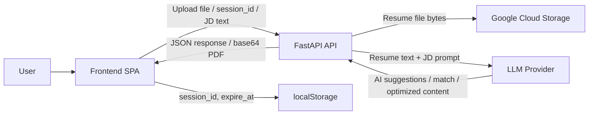
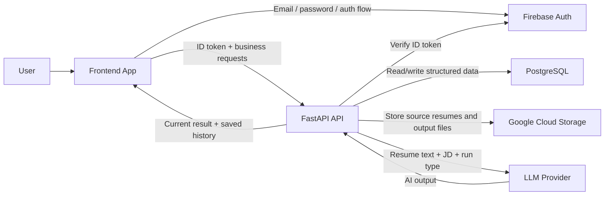
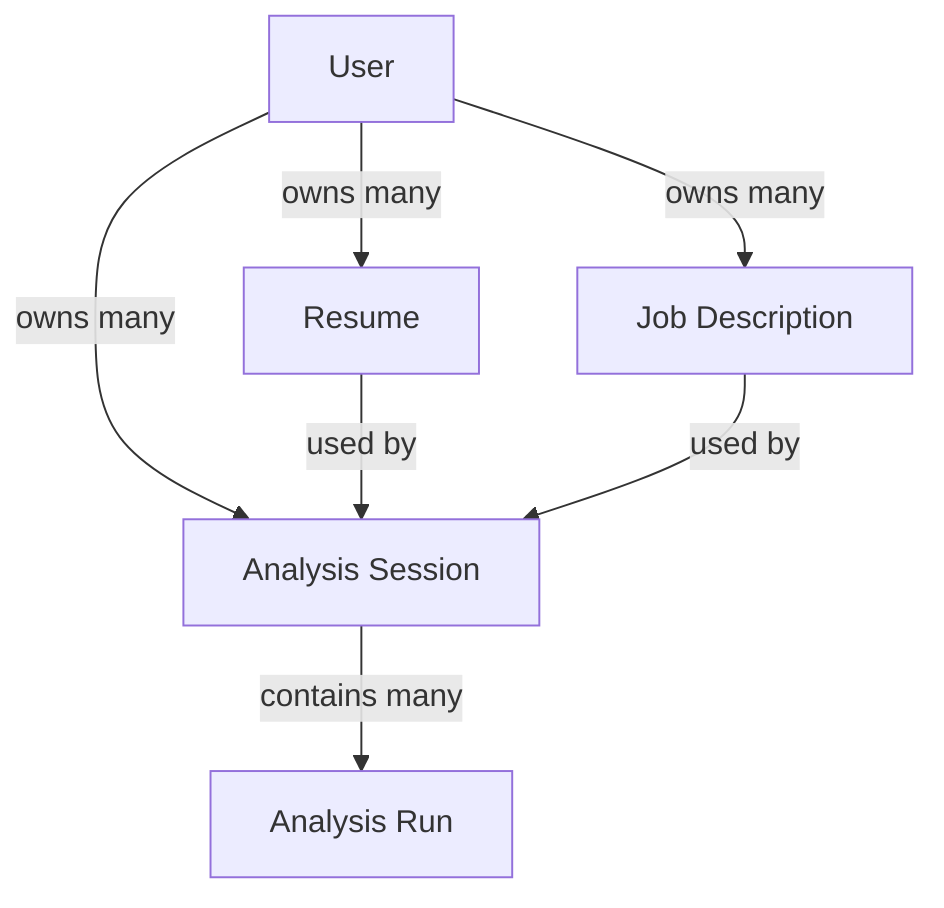

# User System Architecture Comparison

## Purpose

This note summarizes the architecture change required to move ResumAI from an anonymous, session-based tool to a user-based product with account registration, login, and historical AI result lookup.

## Before vs After

| Dimension | Before | After |
| --- | --- | --- |
| User model | Anonymous usage | Registered user accounts |
| Main identifier | `session_id` | `user_id`, `resume_id`, `jd_id`, `analysis_session_id` |
| Auth | None | Firebase Authentication |
| File storage | GCS stores uploaded resumes | GCS stores resumes and generated files |
| Business data storage | Almost no persistent business database | PostgreSQL stores users, resumes, JDs, and AI history |
| AI result storage | Returned directly to frontend, not persisted | Saved as history records and returned to frontend |
| Frontend shape | Single analysis page | Login + dashboard + history + detail pages |
| History lookup | Not supported in practice | Supported per user, per resume, per JD |

## Current Architecture

### What the arrows carry

- `Frontend -> API`: uploaded file, `session_id`, JD text, optimize request
- `API -> GCS`: original resume file
- `API -> LLM`: parsed resume text and optional JD text
- `API -> Frontend`: analysis result, match result, or optimized PDF payload
- `Frontend -> localStorage`: lightweight session data only

## Proposed Architecture

### What the arrows carry

- `Frontend -> Firebase Auth`: registration and login credentials
- `Frontend -> API`: authenticated requests with `Bearer` token and resource IDs
- `API -> PostgreSQL`: users, resumes, job descriptions, analysis sessions, AI run history
- `API -> GCS`: original resumes and generated output files
- `API -> LLM`: prompt content built from stored resume text and JD text
- `API -> Frontend`: current result plus historical records for the logged-in user

## Suggested Core Data Model

## Main Design Meaning

- Before: the system is centered around one temporary `session_id`
- After: the system is centered around a persistent user account and reusable data assets
- Before: AI output is transient
- After: AI output becomes queryable history
- Before: GCS is doing most of the persistence work
- After: GCS stores files, while PostgreSQL stores relationships and history

## Recommended Development Order

1. Add authentication.
2. Add PostgreSQL and data models.
3. Persist analysis results.
4. Add history and detail pages in the frontend.

