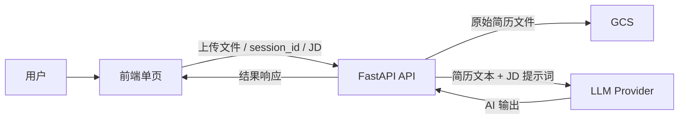
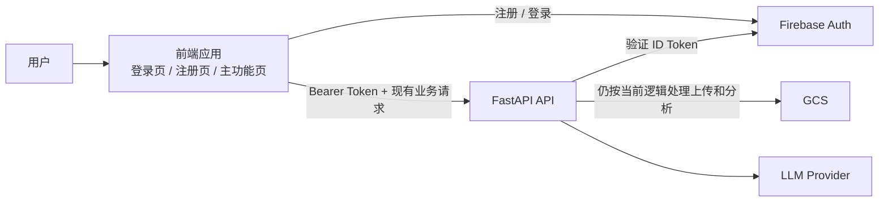
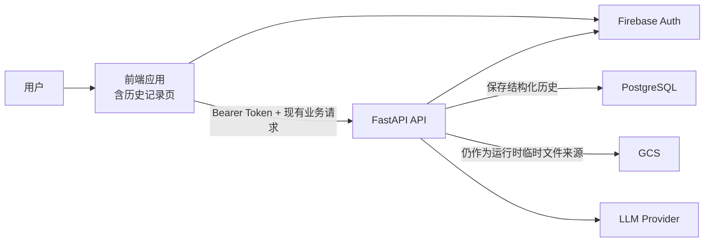
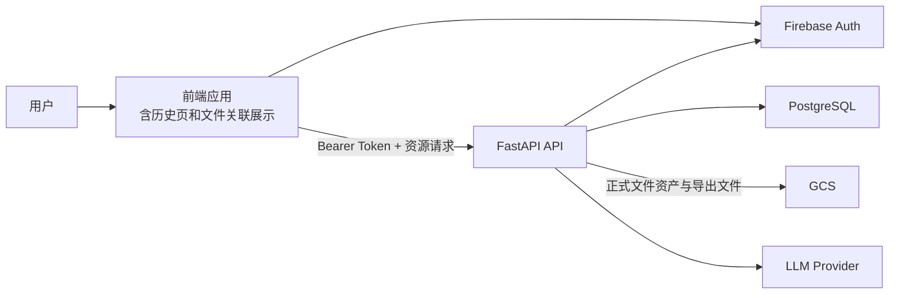

# ResumAI 用户体系与历史记录三阶段演进设计文档

**文档状态**：Draft  
**适用范围**：基于当前仓库代码的下一阶段产品化演进  
**最后更新**：2026-05-16

## 1. 文档目的

本文档用于明确 ResumAI 从当前“匿名、基于 `session_id` 的简历分析工具”，演进为“有用户身份、可查看历史记录、并最终与文件资产打通”的三阶段方案。

本文档明确以下内容：

- 当前代码基线是什么。
- 接下来三阶段分别做什么、不做什么。
- Firebase Auth、PostgreSQL、GCS 各自负责什么。
- 当前 API 哪些保留，后续如何演进，哪些是新增接口。
- 每一阶段前端、后端、配置、测试分别需要完成什么。

## 2. 当前代码基线

### 2.1 当前前端

当前前端是一个单页 React 应用，没有路由层，入口非常简单：

- [frontend/src/App.jsx](/Users/huosiyuan/Desktop/ResumAI/frontend/src/App.jsx:1) 直接渲染 `ResumeAnalysisPage`
- [frontend/src/main.jsx](/Users/huosiyuan/Desktop/ResumAI/frontend/src/main.jsx:1) 没有 `React Router`

这意味着：

- 当前没有登录页、注册页、历史页、详情页。
- 当前也没有受保护页面的概念。

### 2.2 当前后端

当前后端只有一组围绕 `resumes` 的接口：

- `GET /health`
- `POST /api/resumes/`
- `POST /api/resumes/analyze`
- `POST /api/resumes/match`
- `POST /api/resumes/optimize`

对应实现主要在：

- [backend/app/api/routes/__init__.py](/Users/huosiyuan/Desktop/ResumAI/backend/app/api/routes/__init__.py:1)
- [backend/app/api/routes/resumes.py](/Users/huosiyuan/Desktop/ResumAI/backend/app/api/routes/resumes.py:1)

当前没有：

- 用户认证
- 用户表
- PostgreSQL
- 历史记录表
- 资源型 API

### 2.3 当前 GCS 用法

当前系统已经在使用 Google Cloud Storage，但它当前承担的是“临时文件存储”角色，而不是“用户资产管理”角色。

关键行为如下：

- 上传简历后写入 GCS
- 对象路径为 `resumes/{session_id}/{filename}`
- 后续分析、匹配、优化都通过 `session_id` 回取原始文件

对应逻辑主要在：

- [backend/app/services/resume_service.py](/Users/huosiyuan/Desktop/ResumAI/backend/app/services/resume_service.py:52)
- [backend/app/services/storage/gcs_service.py](/Users/huosiyuan/Desktop/ResumAI/backend/app/services/storage/gcs_service.py:48)

### 2.4 当前系统局限

- 系统只知道“这次上传会话”，不知道“这个用户是谁”
- AI 结果只返回前端，不持久化
- 历史数据无法回看
- 原始文件虽然在 GCS，但并未形成“用户拥有的文件资产”
- `localStorage` 当前并不可靠，页面初始化会主动清空本地状态

## 3. 本次确认的产品策略

本次讨论后，产品和技术策略已经明确为以下三阶段：

### Phase 1：只做 Firebase Auth 和用户页面

目标是先把“用户是谁”跑通：

- 用户可以注册、登录、登出
- 系统可以识别用户身份
- 暂时不把用户使用了什么简历、什么 JD、什么 AI 结果写入 PostgreSQL

### Phase 2：存结构化历史，不存文件本体

目标是先把“用户做过什么”保存下来，但不把文件变成正式资产。

这里的关键定义是：

**结构化历史，不存文件本体**

意思是：

- 存用户
- 存 JD 快照
- 存分析结果、匹配结果、优化结果
- 存操作时间、结果类型、结果内容
- 不把简历二进制文件本体存进 PostgreSQL
- 不把导出的 PDF 二进制文件存进 PostgreSQL
- 也不要求在这一阶段把历史记录和正式文件资产强绑定

### Phase 3：把结构化历史和 GCS 文件资产链接起来

目标是把“历史结果”升级成“可关联到具体文件的历史结果”。

这一阶段会做：

- 文件成为正式的用户资产
- 历史结果可以关联到具体简历文件
- 用户可以看到过去的 AI 结果，也能看到它对应的是哪份文件

## 4. 本文档采用的关键假设

为保证设计连贯性，本文档采用以下假设：

- 从 Phase 1 开始，主功能页默认要求登录后访问
- 当前匿名分析模式不再作为长期目标能力
- 当前旧接口全部保留，以降低联调和迁移风险
- PostgreSQL 在 Phase 2 引入，而不是 Phase 1
- `job_descriptions` 独立资源化管理不是本次三阶段的强制目标，Phase 2 先以 JD 快照方式落地

如果未来产品希望保留“游客试用模式”，则路由守卫和接口鉴权策略需要另行补充。

## 5. 三阶段总体架构

### 5.1 当前架构

### 5.2 Phase 1 架构

特点：

- 有身份
- 无 PostgreSQL
- 现有上传与分析流程不做业务数据持久化

### 5.3 Phase 2 架构

特点：

- 有身份
- 有 PostgreSQL
- 有历史记录
- 但历史记录只保存结构化结果，不保存文件本体，不要求正式文件关联

### 5.4 Phase 3 架构

特点：

- 历史记录与文件资产打通
- GCS 从“临时运行时存储”升级为“用户文件资产存储”

## 6. 存储与职责边界

### 6.1 存储职责总表

| 组件 | Phase 1 | Phase 2 | Phase 3 |
| --- | --- | --- | --- |
| Firebase Auth | 存用户认证信息 | 存用户认证信息 | 存用户认证信息 |
| PostgreSQL | 不引入 | 存结构化历史 | 存结构化历史和文件关系 |
| GCS | 继续临时存原始简历 | 继续临时参与运行时处理 | 存正式用户文件和导出文件 |
| localStorage | 只存轻量登录态/UI态 | 只存轻量登录态/UI态 | 只存轻量登录态/UI态 |

### 6.2 Firebase Auth 存什么

Firebase Auth 负责：

- 邮箱
- 密码哈希
- `firebase_uid`
- 邮箱验证状态
- 登录身份生命周期

Firebase Auth 不负责：

- JD
- 历史记录
- 文件元数据
- AI 结果

### 6.3 PostgreSQL 存什么

Phase 2 开始，PostgreSQL 负责：

- 用户记录
- 历史会话记录
- 历史 AI 运行记录
- JD 快照
- 结果快照

Phase 2 不存：

- 原始简历二进制文件
- 优化 PDF 二进制文件
- GCS 文件对象本体

Phase 3 之后，PostgreSQL 额外负责：

- 文件元数据
- 文件与历史记录的关联关系

### 6.4 GCS 存什么

当前到 Phase 2 期间，GCS 仍用于：

- 当前上传流程的原始简历文件

Phase 3 之后，GCS 还将用于：

- 正式的用户简历文件
- 导出的优化 PDF

## 7. “结构化历史，不存文件本体” 的具体定义

### 7.1 Phase 2 推荐存储内容

Phase 2 建议存以下结构化字段：

| 类别 | 示例内容 |
| --- | --- |
| 用户标识 | `user_id`, `firebase_uid`, `email` |
| 历史会话信息 | `analysis_session_id`, `created_at`, `updated_at` |
| 简历快照信息 | `source_session_id`, `source_filename`, `source_file_type` |
| JD 快照 | `company_name`, `job_title`, `job_description_text` |
| 运行类型 | `analyze`, `match`, `optimize` |
| 模型信息 | `provider`, `model_name` |
| AI 输出 | 建议列表、匹配分数、匹配解释、优化文本 |
| 前端展示辅助字段 | 标题、摘要、最近运行时间、状态 |

### 7.2 Phase 2 明确不存的内容

Phase 2 明确不存：

- 简历原始文件二进制内容
- PDF / DOCX / DOC / TXT 文件本体
- 导出的 PDF 二进制内容
- base64 文件体作为长期数据库字段

### 7.3 Phase 2 优化结果如何保存

Phase 2 对 `optimize` 的建议策略是：

- 前端仍可继续接收 base64 PDF 用于即时下载
- PostgreSQL 中不保存 base64 PDF
- PostgreSQL 中只保存结构化的优化结果文本，例如优化后的 markdown/text 和必要元数据

这样可以做到：

- 用户可以回看优化结果内容
- 数据库不会被二进制文件撑大
- 与“Phase 2 不存文件本体”的原则保持一致

## 8. Phase 2 与当前 GCS 的关系

一个容易误解的点是：

**Phase 2 不是“不用 GCS”，而是“不把 GCS 文件正式纳入用户资产模型”。**

也就是说：

- 当前代码的上传、分析、匹配、优化仍会继续依赖 GCS 作为运行时文件来源
- 但是 PostgreSQL 只保存分析历史的结构化结果
- 文件与历史记录的正式、稳定、可回溯关系，留到 Phase 3 再建立

这也是为什么 Phase 2 即使文件过期或被清理，用户仍然可以看到当时生成的 AI 历史结果，因为结果快照已经进入数据库。

## 9. 数据模型设计

## 9.1 Phase 1 数据模型

Phase 1 不引入 PostgreSQL，因此不建立业务表。

用户身份由 Firebase Auth 直接提供。

后端在这一阶段只需要能从 Token 中解析出：

- `firebase_uid`
- `email`
- `display_name`
- `email_verified`

## 9.2 Phase 2 数据模型

Phase 2 推荐最小表结构如下：

### `users`

| 字段 | 说明 |
| --- | --- |
| `id` | 内部主键 |
| `firebase_uid` | Firebase 用户唯一标识 |
| `email` | 邮箱 |
| `display_name` | 展示名 |
| `created_at` | 创建时间 |
| `last_login_at` | 最近登录时间 |

### `analysis_sessions`

说明：一条记录表示“某用户围绕一次简历上下文和一份 JD 上下文形成的历史会话容器”。

| 字段 | 说明 |
| --- | --- |
| `id` | 主键 |
| `user_id` | 所属用户 |
| `source_session_id` | 当前旧上传流程返回的 `session_id` 快照 |
| `source_filename` | 当时上传的文件名快照 |
| `source_file_type` | 文件类型快照 |
| `company_name` | JD 快照 |
| `job_title` | JD 快照 |
| `job_description_text` | JD 快照全文 |
| `title` | 历史记录页展示标题 |
| `latest_run_type` | 最近一次运行类型 |
| `latest_match_score` | 最近匹配分数，可为空 |
| `created_at` | 创建时间 |
| `updated_at` | 更新时间 |

### `analysis_runs`

说明：一条记录表示一次具体的 AI 执行结果。

| 字段 | 说明 |
| --- | --- |
| `id` | 主键 |
| `analysis_session_id` | 所属历史会话 |
| `run_type` | `analyze` / `match` / `optimize` |
| `provider` | LLM 供应商 |
| `model_name` | 模型名称 |
| `request_snapshot_json` | 请求快照 |
| `response_payload_json` | 结果快照 |
| `created_at` | 创建时间 |

### Phase 2 为什么不单独建 `job_descriptions`

因为当前三阶段方案里，第二阶段的目标是“先能看历史”，不是“先把 JD 做成独立可复用资源”。  
所以此阶段优先将 JD 作为快照保存在 `analysis_sessions` 中，减少复杂度。

如果未来产品要支持：

- 我的 JD 列表
- 独立复用一份 JD
- 给同一个 JD 关联多次分析

再单独引入 `job_descriptions` 表会更合适。

## 9.3 Phase 3 数据模型

Phase 3 在 Phase 2 基础上新增文件资产表。

### `resumes`

| 字段 | 说明 |
| --- | --- |
| `id` | 主键 |
| `user_id` | 所属用户 |
| `original_filename` | 原始文件名 |
| `mime_type` | 文件类型 |
| `file_size` | 文件大小 |
| `gcs_object_path` | GCS 路径 |
| `parsed_text` | 解析出的文本，可选 |
| `created_at` | 创建时间 |

### `analysis_sessions` 新增字段

| 字段 | 说明 |
| --- | --- |
| `resume_id` | 可空，关联正式文件资产 |

这里 `resume_id` 允许为空，是为了兼容：

- Phase 2 已存在的历史记录
- 当时只保存了结构化历史，但没有正式文件关系的旧数据

## 10. API 设计演进

## 10.1 当前 API

| API | 当前作用 |
| --- | --- |
| `GET /health` | 健康检查 |
| `POST /api/resumes/` | 上传简历，返回 `session_id` |
| `POST /api/resumes/analyze` | 基于 `session_id` 做分析 |
| `POST /api/resumes/match` | 基于 `session_id + JD` 做匹配 |
| `POST /api/resumes/optimize` | 基于 `session_id + JD/template` 做优化 |

## 10.2 总体 API 策略

本设计选择：

- 旧接口全部保留
- 不做破坏式删除
- 通过“接口兼容 + 内部逻辑升级”来支撑三阶段演进

原因：

- 当前前端完全依赖旧接口
- 一次性换接口风险过高
- 分阶段建设更适合当前项目节奏

## 10.3 API 演进总表

| API | 当前状态 | Phase 1 | Phase 2 | Phase 3 |
| --- | --- | --- | --- | --- |
| `GET /health` | 已有 | 保留 | 保留 | 保留 |
| `GET /api/me` | 无 | 新增 | 保留 | 保留 |
| `POST /api/resumes/` | 已有 | 保留，接收 Bearer Token | 保留，继续上传但不入正式文件表 | 保留并升级为正式文件资产创建入口 |
| `POST /api/resumes/analyze` | 已有 | 保留 | 保留，并新增历史写入副作用 | 保留，并可关联 `resume_id` |
| `POST /api/resumes/match` | 已有 | 保留 | 保留，并新增历史写入副作用 | 保留，并可关联 `resume_id` |
| `POST /api/resumes/optimize` | 已有 | 保留 | 保留，并新增历史写入副作用 | 保留，并可关联 `resume_id` 和导出文件 |
| `GET /api/analysis-sessions` | 无 | 无 | 新增 | 保留 |
| `GET /api/analysis-sessions/{id}` | 无 | 无 | 新增 | 保留 |
| `GET /api/analysis-sessions/{id}/runs` | 无 | 无 | 新增 | 保留 |
| `GET /api/resumes` | 无 | 无 | 无 | 新增 |
| `GET /api/resumes/{id}` | 无 | 无 | 无 | 新增 |
| `DELETE /api/resumes/{id}` | 无 | 无 | 无 | 新增 |

## 10.4 各接口的详细演进方式

### `GET /api/me`

Phase 1 新增。

职责：

- 验证当前登录用户是否有效
- 返回前端当前用户信息

Phase 1 返回可直接来自 Firebase Token 解码结果。  
Phase 2 开始可逐步改为“Token + DB 用户记录”的组合响应。

### `POST /api/resumes/`

当前行为：

- 上传简历到 GCS
- 返回 `session_id` 和 `expire_at`

Phase 1：

- 接口路径和请求体不变
- 前端开始携带 `Bearer Token`
- 后端识别调用用户，但不做 PostgreSQL 落库

Phase 2：

- 行为仍基本不变
- 继续返回 `session_id`
- 不创建正式文件资产记录
- 但后续基于该 `session_id` 产生的分析结果，会被持久化为结构化历史

Phase 3：

- 保留现有响应字段以兼容旧前端
- 新增正式文件资产创建逻辑
- 建议新增响应字段：
  - `resume_id`
  - `gcs_object_path`

### `POST /api/resumes/analyze`

当前行为：

- 只做即时分析
- 不落库

Phase 1：

- 行为不变
- 前端带 Token

Phase 2：

- 行为对前端保持兼容
- 后端在返回结果前，新增：
  - 查找或创建 `analysis_session`
  - 写入一条 `analysis_run`

Phase 3：

- 在 Phase 2 基础上，若当前上下文已经关联正式文件资产，则写入 `resume_id`

### `POST /api/resumes/match`

当前行为：

- 输入 JD 内容
- 返回匹配分数和建议

Phase 1：

- 行为不变

Phase 2：

- 除即时响应外，同时保存：
  - JD 快照
  - 分析结果
  - 匹配分数

Phase 3：

- 在历史记录中展示关联文件

### `POST /api/resumes/optimize`

当前行为：

- 返回 base64 PDF

Phase 1：

- 行为不变

Phase 2：

- 仍继续返回 base64 PDF 供前端即时下载
- 同时把“优化后的文本结果”写入 PostgreSQL
- 不把 base64 PDF 存到 PostgreSQL

Phase 3：

- 优化产物可上传到 GCS
- 历史记录中可显示导出文件关联

### `GET /api/analysis-sessions`

Phase 2 新增。

用途：

- 历史记录列表页
- 按用户查看历史分析会话

### `GET /api/analysis-sessions/{id}`

Phase 2 新增。

用途：

- 历史详情页头部信息
- 返回会话级信息与摘要

### `GET /api/analysis-sessions/{id}/runs`

Phase 2 新增。

用途：

- 查看一个历史会话下的全部运行记录
- 支持展示 analyze / match / optimize 时间线

### `GET /api/resumes`

Phase 3 新增。

用途：

- 查看用户正式文件资产列表

### `GET /api/resumes/{id}`

Phase 3 新增。

用途：

- 查看某个文件资产详情

### `DELETE /api/resumes/{id}`

Phase 3 新增。

用途：

- 删除文件资产
- 需要明确定义是否同时删除 GCS 文件，以及对历史记录采取什么策略

## 11. 三阶段详细开发计划

## 11.1 Phase 1：Firebase Auth 与用户页面

### 目标

先把“用户是谁”建立起来，让系统具备登录态和最小后端鉴权能力。

### 范围内

- Firebase Auth
- 注册
- 登录
- 登出
- 前端路由体系
- 受保护页面
- 后端 Token 校验
- `GET /api/me`

### 范围外

- PostgreSQL
- 历史记录
- 文件资产建模
- JD 存储
- AI 结果持久化

### 前端任务

- 引入 `React Router`
- 增加登录页
- 增加注册页
- 增加基础用户页或主入口页
- 增加 Auth Context 或等价状态管理
- 增加受保护路由组件
- 将当前 `ResumeAnalysisPage` 放到登录后可访问路径下
- 登录后前端请求后端时统一附带 `Bearer Token`
- 增加登出入口

### 后端任务

- 引入 Firebase Admin SDK
- 新增认证配置项
- 封装 Token 校验依赖
- 新增 `/api/me`
- 为未来预留统一的 `current_user_claims`
- 保持现有 `/api/resumes/*` 业务接口不破坏

### 配置与基础设施任务

- 创建或整理 Firebase 项目
- 配置前端 Firebase env
- 配置后端 Firebase Admin 凭据
- 在 QA 和生产环境分别配置 secrets

### 测试任务

- 注册成功
- 登录成功
- 登录失败提示正确
- 无效 Token 访问受保护接口失败
- 登录用户访问 `/api/me` 成功
- 前端登出后无法继续访问受保护页面

### 验收标准

- 用户可以注册、登录、登出
- 登录态在刷新后仍能恢复
- 前端能拿到当前用户信息
- 后端能验证 Token 并识别用户
- 当前分析主流程仍然可用

### 风险

- 当前前端没有路由，Phase 1 会引入页面结构变化
- 如果产品希望保留游客模式，路由守卫需要调整

## 11.2 Phase 2：PostgreSQL 与结构化历史

### 目标

在不引入正式文件资产模型的前提下，让用户能查看自己过去做过的分析记录。

### 范围内

- PostgreSQL
- `users`
- `analysis_sessions`
- `analysis_runs`
- 历史列表页
- 历史详情页
- 旧接口的历史写入副作用

### 范围外

- 正式文件资产管理
- `resume_id` 与 GCS 文件的稳定绑定
- 独立 JD 资源管理

### 设计重点

这一阶段的核心原则是：

**存结构化历史，不存文件本体**

### 前端任务

- 新增历史记录列表页
- 新增历史详情页
- 历史记录展示字段包括：
  - 标题
  - 公司名
  - 职位名
  - 最近运行类型
  - 最近更新时间
  - 结果摘要
- 运行新分析后，支持跳转或刷新历史列表
- 历史详情页支持查看一次会话下的多次运行结果

### 后端任务

- 引入 PostgreSQL
- 接入 SQLAlchemy 和 Alembic
- 创建 `users`、`analysis_sessions`、`analysis_runs`
- 在认证后请求中，第一次按需创建或更新 `users` 记录
- 改造以下旧接口：
  - `POST /api/resumes/analyze`
  - `POST /api/resumes/match`
  - `POST /api/resumes/optimize`
- 改造逻辑要求：
  - 继续返回旧响应
  - 同时持久化结构化历史
- 新增历史查询接口：
  - `GET /api/analysis-sessions`
  - `GET /api/analysis-sessions/{id}`
  - `GET /api/analysis-sessions/{id}/runs`

### 历史会话创建规则

为了兼容当前旧前端，建议采用以下规则：

- 当用户基于某个 `session_id` 首次发起 analyze / match / optimize 时
- 后端根据以下信息创建或匹配一个 `analysis_session`
  - `user_id`
  - `source_session_id`
  - `source_filename`
  - JD 快照 hash

这样可实现：

- 同一份上传上下文 + 同一份 JD 快照下的多次运行进入同一会话
- 不要求旧前端理解 `analysis_session_id`

### 优化结果持久化规则

对于 `optimize`：

- 即时下载能力保持不变
- 入库只存优化文本与元数据
- 不存 base64 PDF

### 配置与基础设施任务

- 新建 Cloud SQL PostgreSQL
- 建立连接配置
- 配置迁移命令
- 在 CI/CD 中加入 migration 步骤

### 测试任务

- 登录用户执行 analyze 后生成历史记录
- 登录用户执行 match 后生成历史记录
- 登录用户执行 optimize 后生成历史记录
- 历史记录只对当前用户可见
- 历史详情能看到对应 run 列表
- 即使原始临时文件后续不可用，已保存的结构化历史仍可查看

### 验收标准

- 用户能看到自己的历史记录列表
- 用户能打开某条历史详情
- 历史中能看到 JD 快照和 AI 结果快照
- 数据库中没有保存文件本体
- 现有前端分析能力不被破坏

### 风险

- Phase 2 历史记录可能无法回链到原始文件
- 旧上传流程如果发生变化，会影响 `source_session_id` 兼容策略

## 11.3 Phase 3：历史记录与文件资产打通

### 目标

让用户的历史记录可以明确关联到具体文件，完成“结果 - 文件”闭环。

### 范围内

- `resumes` 表
- 正式文件资产建模
- GCS 路径升级
- 历史记录与文件关联
- 文件资产展示页或详情区块

### 范围外

- 更复杂的版本管理
- 多份 JD 的独立资源化
- 高级文件协作能力

### 前端任务

- 在历史记录页展示“关联文件”信息
- 在历史详情页展示该记录关联的简历文件
- 为旧 Phase 2 历史记录展示“未关联文件”或“历史快照”标识
- 增加文件列表页或文件详情展示

### 后端任务

- 创建 `resumes` 表
- 升级 `POST /api/resumes/`：
  - 除当前返回 `session_id` 外
  - 同时创建正式文件资产记录
- 新增：
  - `GET /api/resumes`
  - `GET /api/resumes/{id}`
  - `DELETE /api/resumes/{id}`
- 为新会话写入 `resume_id`
- 优化后导出文件可选择上传到 GCS 并记录路径

### GCS 路径设计建议

当前路径：

- `resumes/{session_id}/{filename}`

Phase 3 目标路径建议：

- 原始简历：`users/{user_id}/resumes/{resume_id}/source/{filename}`
- 导出文件：`users/{user_id}/analysis-sessions/{analysis_session_id}/runs/{run_id}/optimized.pdf`

### 历史数据兼容策略

Phase 2 旧数据会存在以下情况：

- 有历史记录
- 没有正式 `resume_id`

因此 Phase 3 需要支持：

- 新记录有文件关联
- 旧记录没有文件关联也仍可正常展示

不建议承诺对所有旧历史自动回填文件关系。

### 配置与基础设施任务

- 检查 GCS Bucket 权限
- 明确文件删除策略
- 明确导出文件保留策略
- 如需要，增加 signed URL 或后端代理下载

### 测试任务

- 新上传文件能创建正式文件资产
- 新历史记录能关联到 `resume_id`
- 用户可查看文件关联信息
- 用户无法访问他人文件
- 删除文件后历史记录的展示逻辑清晰可控

### 验收标准

- 用户能在历史记录中看到对应文件
- 新上传和新分析流程形成完整闭环
- 文件访问权限正确
- 旧历史数据不会因为没有 `resume_id` 而不可用

### 风险

- Phase 2 历史与 Phase 3 文件资产之间无法完整自动回填
- 删除文件和保留历史之间的策略需要提前定好

## 12. 实施顺序建议

建议严格按以下顺序推进：

1. 先完成 Phase 1，建立用户身份闭环
2. 再完成 Phase 2，建立结构化历史能力
3. 最后完成 Phase 3，建立文件资产关联

不建议：

- 在 Phase 1 同时引入 PostgreSQL
- 在 Phase 2 直接把文件资产模型一次性做完
- 在没有历史能力的情况下先强做文件资产页面

## 13. 与当前代码最相关的改造点

### 前端

- [frontend/src/App.jsx](/Users/huosiyuan/Desktop/ResumAI/frontend/src/App.jsx:1) 需要从单页入口升级为路由入口
- [frontend/src/main.jsx](/Users/huosiyuan/Desktop/ResumAI/frontend/src/main.jsx:1) 需要接入 Router Provider
- [frontend/src/pages/ResumeAnalysisPage.jsx](/Users/huosiyuan/Desktop/ResumAI/frontend/src/pages/ResumeAnalysisPage.jsx:1) 需要逐步从匿名页改成登录后主功能页

### 后端

- [backend/app/api/routes/__init__.py](/Users/huosiyuan/Desktop/ResumAI/backend/app/api/routes/__init__.py:1) 需要新增 `me`、`analysis_sessions` 等路由聚合
- [backend/app/api/routes/resumes.py](/Users/huosiyuan/Desktop/ResumAI/backend/app/api/routes/resumes.py:48) 当前旧接口保留，但内部逻辑需逐步升级
- [backend/app/services/resume_service.py](/Users/huosiyuan/Desktop/ResumAI/backend/app/services/resume_service.py:52) 当前仍然是 `session_id + GCS` 模式，Phase 3 再引入正式文件资产逻辑

## 14. 风险、边界与后续扩展

### 当前明确风险

- 现有分析结果没有历史数据，旧结果无法自动补齐
- 当前前端没有路由，Phase 1 必然涉及页面结构调整
- GCS 当前是临时路径模型，Phase 3 需要升级路径规范

### 本文档刻意延后的能力

- 独立 JD 资产管理
- 简历版本管理
- 历史记录高级搜索
- 多用户协作

这些能力不是不能做，而是不应在当前三阶段里一起引入。

## 15. 最终结论

本次设计采用三阶段方案，而不是一次性重构：

- **Phase 1**：先做 Firebase Auth 和用户页面，只解决“用户是谁”
- **Phase 2**：再上 PostgreSQL，保存结构化历史，不存文件本体
- **Phase 3**：最后把历史记录和 GCS 文件资产打通

这个方案最大的优点是：

- 贴合当前代码现实
- 不会一次改动过大
- 可以尽快上线第一阶段
- 为后续历史页和文件资产页预留稳定演进路径

如果后续产品要把 JD 也做成独立资源，建议作为本设计之后的下一轮迭代单独立项。

